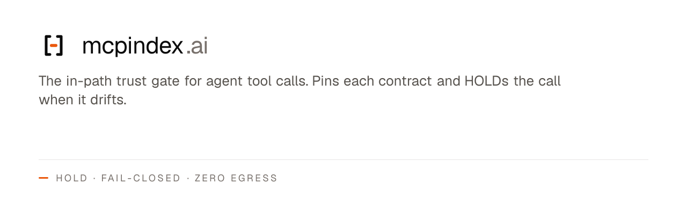

<p align="center">
  <a href="https://mcpindex.ai"></a>
</p>

# mcpindex.ai

> The in-path trust gate for agent tool calls.

MCP tool contracts can change remotely with no version bump. mcpindex **pins each contract** and **HOLDs the call** when it drifts — before your agent acts. Deterministic contract-diff on your host. Zero credential custody. Not a safety oracle.

[Live site](https://mcpindex.ai) · [Install](https://mcpindex.ai/#install) · [Docs](https://mcpindex.ai/docs) · [Trust](https://mcpindex.ai/trust) · [Methodology](https://mcpindex.ai/methodology) · [npm: mcp-server-mcpindex](https://www.npmjs.com/package/mcp-server-mcpindex)

## What you get

1. **In-path drift gate** — one command wires Claude Desktop / Cursor / Cline / Zed so each MCP server launches behind the gate. Local, fail-closed, default build egresses nothing.  
   `curl -fsSL https://mcpindex.ai/install.sh | sh` (inspect first with `| less`)
2. **Advisory directory** — search, recommend, preflight, and trust lookups over HTTP or as a drop-in MCP server (`mcp-server-mcpindex`). Screen verdicts are REVIEW / UNVERIFIED at v1; ALLOW / DENY are reserved in the contract.
3. **Agent-readable surfaces** — `/llms.txt`, `/.well-known/mcp-index.json`, JSON-LD, and 3,500+ per-server pages.

The gate is the wedge. The directory is the corpus the gate can query — also free.

## Develop

```bash
npm install
node scripts/fetch-snapshot.mjs    # one-time: pull current registry snapshot
npm run dev                         # http://localhost:3000
```

Snapshot lives at `data/snapshot.json` (committed). Refresh anytime with the script.

## Stack

- Next.js 16 (App Router) on Vercel
- Tailwind v4
- Local snapshot of `registry.modelcontextprotocol.io/v0/servers`, refreshed daily via Vercel cron
- Quality Score: `lib/quality.ts` (open methodology - PRs welcome)
- Search: `lib/search.ts` (keyword now; embeddings v2 when OPENAI_API_KEY is wired)

## Project layout

```
mcpindex/
├── app/                    # Next.js routes
│   ├── api/v1/             # Versioned public API
│   ├── api/cron/           # Vercel-cron-driven endpoints
│   ├── server/[slug]/      # per-server pages (top-N SSG + ISR)
│   ├── best/[category]/    # curated category pages
│   └── ...                 # docs, trust, methodology, pricing, ledger, …
├── components/             # Header, Footer, DriftGateDemo, LiveTicker, …
├── lib/                    # registry, quality, search, verdicts, installs, …
├── scripts/                # sync-registry.mjs, fetch-snapshot.mjs, honesty guard
├── data/                   # snapshot.json (committed) + snapshots/ (cron-written)
├── mcp-server-mcpindex/    # the npm-distributed MCP directory client
└── …
```

## License

- Web app code: source-available, all-rights-reserved (prevents direct fork-and-deploy by competitors).
- `mcp-server-mcpindex` (the npm package): MIT.
- MCP Quality Score methodology: open and PR-friendly.

## Affiliation

Unofficial. Not affiliated with Anthropic. The Model Context Protocol is open under MIT and trademarks remain with their owners. Server data comes from the official MCP registry.
